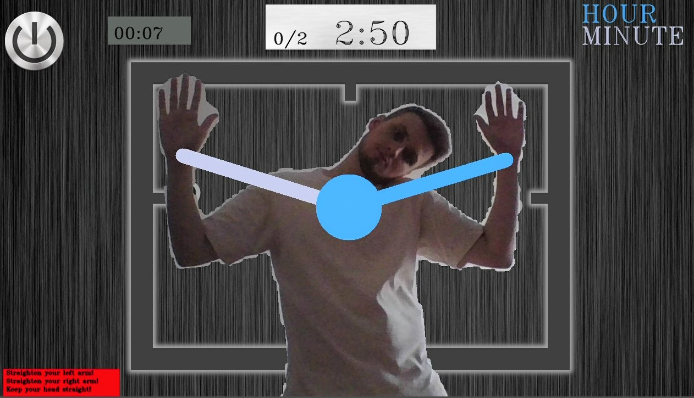

<h1 align=center>Game O'Clock</h1>
<h2>Description :page_facing_up:</h2>

    This is a simple and fun game in which the user's hands turn into analog clock hands. You won't be bored! &#128589; + &#128342; = &#128131  
    After starting the game, the user is immersed in an interactive world of entertainment. &#128126;  
    There are three modes available in the game: easy &#128526;, hard &#129327; and alarm mode &#128564;.

<h2>Game play &#127918;</h2>

In the game, a person turns into a clock and must show the time with his hands, like the hands of a clock.

  
<h3>Easy &#128526;</h3>

In easy mode, the user is limited only by the number of rounds. But there is a calculation of the total time and you can compete in the speed of execution.

 

<h3>Hard &#129327;</h3>

In hard mode, ten seconds are allocated for each round. If the user does not have enough time to take the required pose during the round, he loses the score. After that, the game continues on!

 

<h3>Alarm mode &#128564;</h3>

In the alarm mode, pleasant wake-up music plays, but to turn it off you need to show the time!

 
<h2>Stack &#128295;</h2>
<ul>
 <li><a href="https://mediapipe.dev/"> MediaPipe </a> for pose recognition and segmentation;</li>
 <li><a href="https://opencv.org/"> OpenCV </a>  for working with images.</li>
</ul>

<h2>Posture Correction &#9989;</h2>

In the game, you can turn on the posture adjustment mode. If your arms are bent or your head is tilted, the time will not count. And corresponding warnings will be displayed in the lower left corner!

    

<h2>This project was completed in 10 days by:</h2>

<a href="https://github.com/PavelBogoslovskiy"> Pavel Bogoslovskiy </a>  
<a href="https://github.com/JuliaRebrova"> Julia Rebrova </a>

