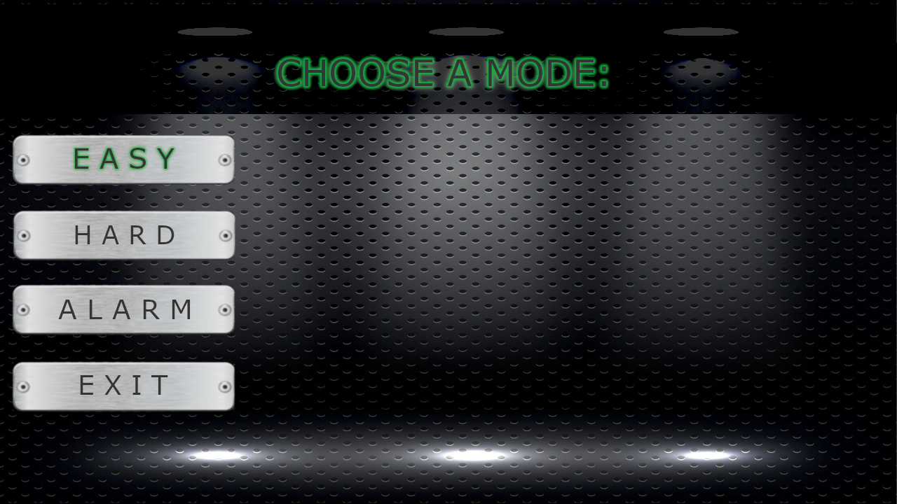

<h1 align=center>Game O'Clock</h1>
<h2>Description :page_facing_up:</h2>

    This is a simple and fun game in which the user's hands turn into analog clock hands. You won't be bored! &#128589; + &#128342; = &#128131  
    After starting the game, the user is immersed in an interactive world of entertainment. &#128126;  
    There are three modes available in the game: easy &#128526;, hard &#129327; and alarm mode &#128564;.

